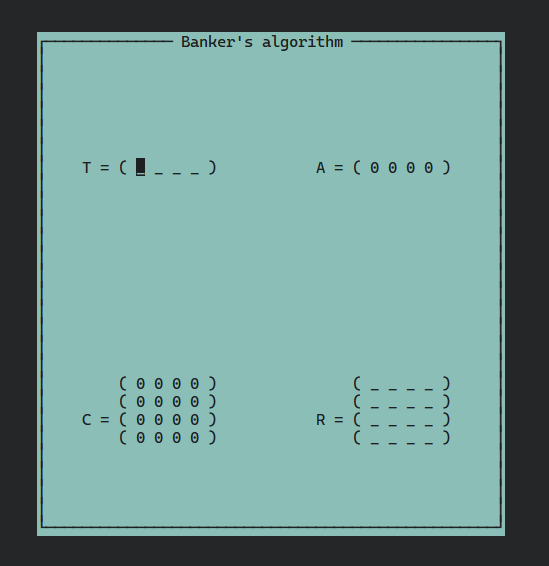

### Реализация Алгоритма Банкира

Алгоритм Банкира нужен для проверки наличия блокировок в программе.

Программа работает на стэке: `C + ncurses`.

#### Как собирать

Следуем простой инструкции внизу.

```bash
git clone https://git.bk252.ru/delvin/lab7.git
cd lab7/homework
make
./banker
```


#### Версии сборки

```bash
ncurses: версия 6.2
GNU C Library (Debian GLIBC 2.31-9) stable release version 2.31.
```

---

#### Скриншот из окна программы

Пример окна программы.



---

#### Как использовать

Для взаимодействия с программой был реализован механизм удобного перемещения по матрице `R` и вектору `T`. Для перемещения используются стрелки на клавиатуре.

Чтобы ввести значение в матрицу необходимо установить курсор на нужной позиции и ввести цифру. Далее для `запуска` неоходимо нажать `пробел`. Программа в начале проверит корректность ввода, и далее запустит алгоритм `Банкира` для проверки наличия `блокировок` в программе.