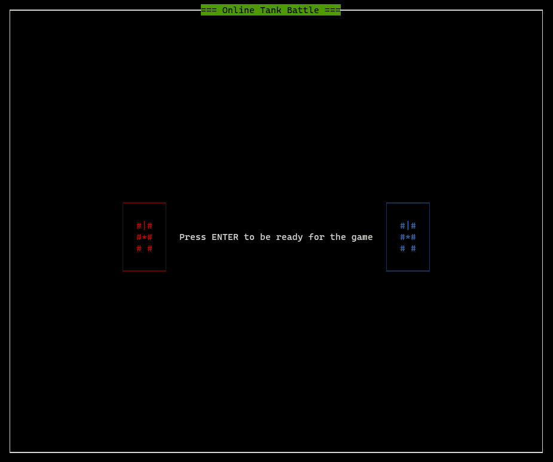
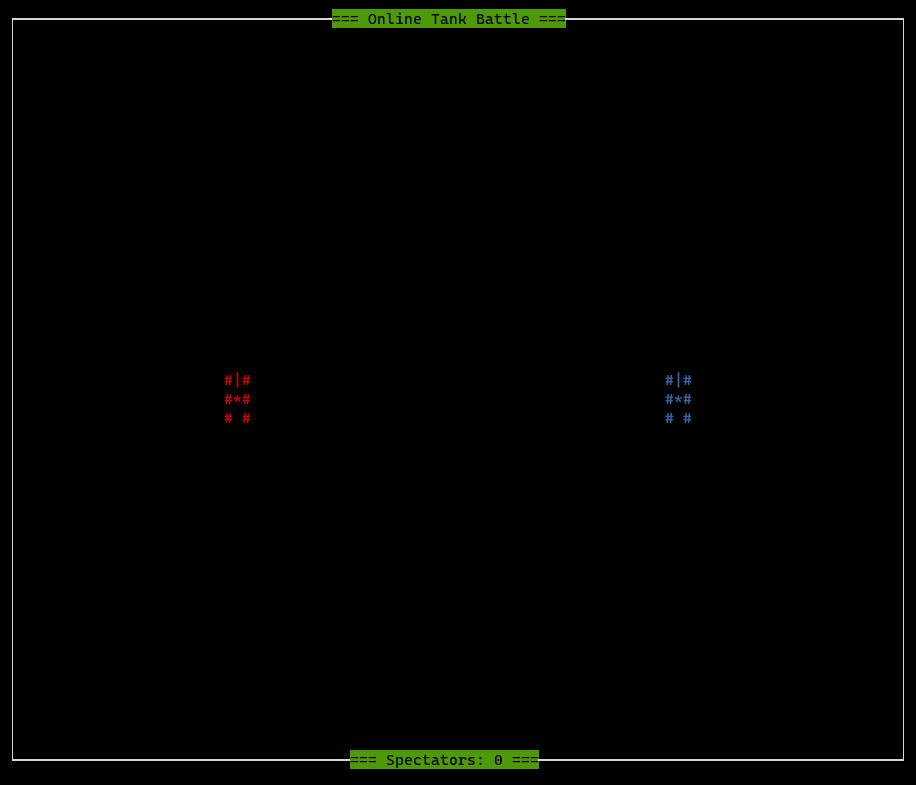
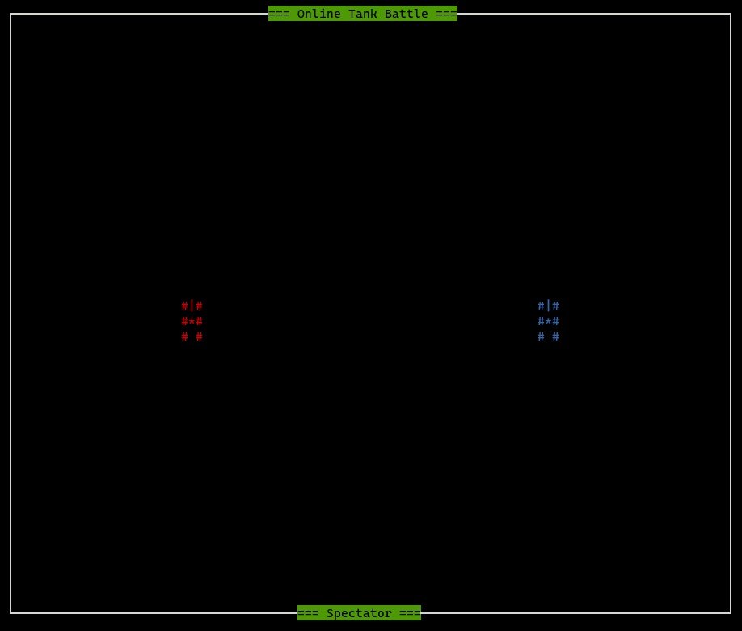
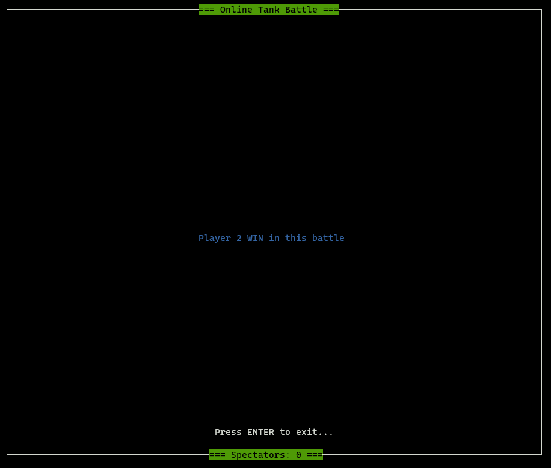

# Battle of Tanks

Online Battle of Tanks game written in C with ncurses.

### Build

There are several options for building a project:

```bash
make mode=debug # build binary in debug mode
make mode=local # build binary in release mode but with my VPN support
make mode=release # build for classroom without my VPN support
```

The ELFs are located in the `bin` folder.

### VPN

I built my own VPN network so that the guys and I could test and play tanks without leaving our homes.


### Run

How startup game:

```bash
./bin/game <ip1> <ip2>
```

Usage menu in program:

```bash
Usage: ./bin/game <ip1> <ip2>
        <ip1> - Player 1
        <ip2> - Player 2
A blinking block indicates that the player has not yet accepted the game
Good luck!
```

### Screenshots of the game

**Waiting for the game:**



**Game screen:**



**Spectator Screen:**



**Win screen:**

